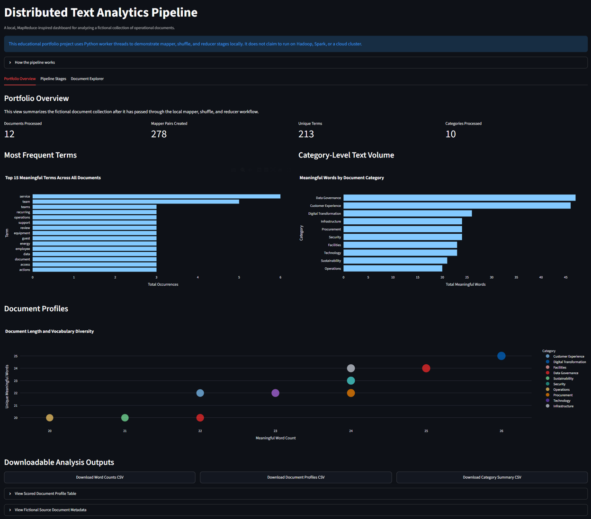
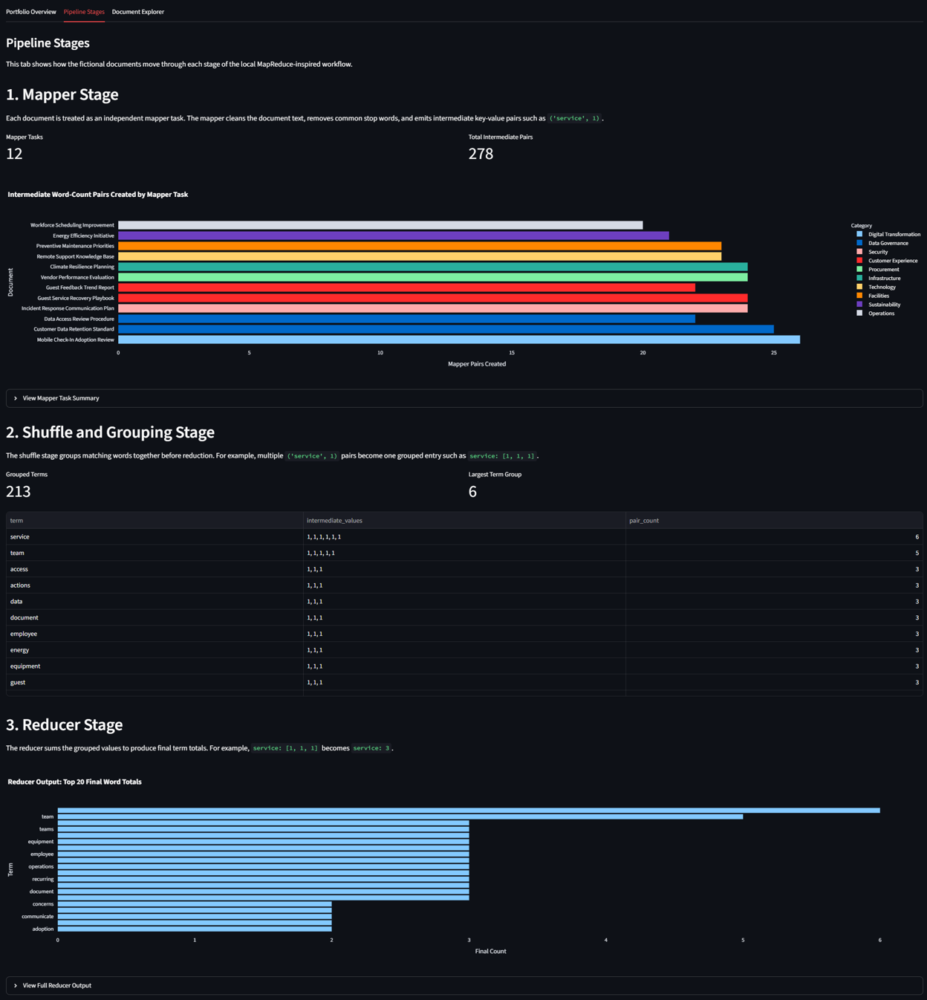
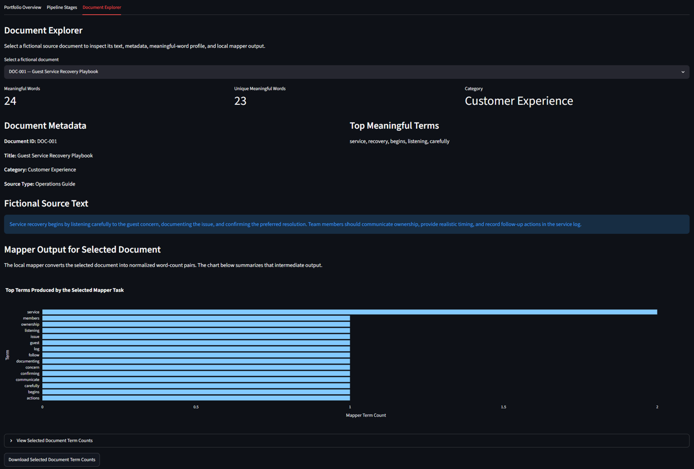
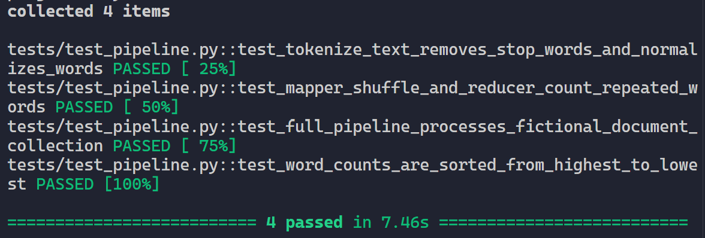

# Distributed Text Analytics Pipeline

A local, MapReduce-inspired text analytics dashboard that processes a fictional collection of operational documents through mapper, shuffle, and reducer stages.

The project demonstrates parallel document processing, word-frequency analysis, document profiling, category-level summaries, CSV exports, automated testing, and interactive visualization through a Streamlit dashboard.

> **Important:** This is an educational portfolio project. It uses local Python worker threads to demonstrate the logical stages of MapReduce. It does not claim to run on Hadoop, Spark, or a cloud-based distributed-computing platform.

## Project Highlights

- Processes a fictional collection of 12 operational documents
- Uses a local, MapReduce-inspired workflow:
  - Mapper
  - Shuffle and grouping
  - Reducer
- Runs independent document mapper tasks through Python worker threads
- Cleans and tokenizes text using lowercase normalization and stop-word removal
- Produces intermediate key-value pairs such as `("service", 1)`
- Groups matching terms before calculating final word-frequency totals
- Creates document-level text profiles and category summaries
- Provides interactive Streamlit dashboard views
- Supports downloadable CSV analysis outputs
- Includes automated tests for tokenizer, mapper, shuffle, reducer, and full-pipeline behavior

## Technology Stack

| Category | Tools |
|---|---|
| Programming Language | Python |
| Dashboard | Streamlit |
| Data Processing | Pandas |
| Visualization | Plotly |
| Parallel Processing | `concurrent.futures.ThreadPoolExecutor` |
| Testing | Pytest |
| Data Format | CSV |
| Version Control | Git and GitHub |
| Development Environment | VS Code |

## Local MapReduce-Inspired Workflow

```text
Fictional document collection
            ↓
Parallel mapper tasks
            ↓
Intermediate word-count pairs
            ↓
Shuffle and grouping stage
            ↓
Reducer aggregation
            ↓
Dashboard analytics and CSV exports
```

### 1. Mapper Stage

Each fictional document is treated as an independent mapper task.

The mapper:

- Converts text to lowercase
- Extracts alphabetic words
- Removes short words and common stop words
- Creates intermediate key-value pairs

Example mapper output:

```text
("guest", 1)
("service", 1)
("service", 1)
("operations", 1)
```

### 2. Shuffle and Grouping Stage

The shuffle stage groups matching terms together before reduction.

Example:

```text
Input:
("service", 1)
("guest", 1)
("service", 1)

Grouped output:
"service": [1, 1]
"guest": [1]
```

### 3. Reducer Stage

The reducer adds the grouped values to calculate final term totals.

Example:

```text
Input:
"service": [1, 1]
"guest": [1]

Reducer output:
"service": 2
"guest": 1
```

## Current Sample Pipeline Results

Using the included fictional document collection, the current pipeline run produces:

| Metric | Result |
|---|---:|
| Documents processed | 12 |
| Mapper tasks created | 12 |
| Intermediate mapper pairs created | 278 |
| Unique grouped terms | 213 |
| Categories processed | 10 |
| Automated tests passed | 4 |

These counts are based on the included fictional dataset. Results will change if the dataset, tokenizer rules, or stop-word list is changed.

## Dashboard Features

### Portfolio Overview

The **Portfolio Overview** tab provides a high-level summary of the fictional document collection after pipeline processing.

It includes:

- Total documents processed
- Total mapper pairs created
- Number of unique terms
- Number of categories processed
- Top meaningful terms across all documents
- Category-level meaningful-word volume
- Document length and vocabulary-diversity visualization
- Downloadable word-count CSV
- Downloadable document-profile CSV
- Downloadable category-summary CSV
- Expandable document-profile table
- Expandable fictional source-document metadata table

### Pipeline Stages

The **Pipeline Stages** tab makes each stage of the workflow visible.

It includes:

- Mapper task count and total intermediate pairs
- Mapper-pair chart by document
- Mapper task summary table
- Shuffle and grouping preview
- Grouped-term count and largest-term-group metric
- Reducer output chart for the highest-frequency terms
- Expandable full reducer-output table

### Document Explorer

The **Document Explorer** tab allows users to inspect one fictional source document at a time.

It includes:

- Document ID, title, category, and source type
- Meaningful-word count
- Unique meaningful-word count
- Top meaningful terms
- Fictional source text
- Mapper output chart for the selected document
- Expandable term-count table
- Downloadable selected-document term-count CSV

## Fictional Dataset

The project uses a fictional collection of operational documents across the following topics:

- Customer Experience
- Digital Transformation
- Facilities
- Data Governance
- Sustainability
- Security
- Operations
- Procurement
- Technology
- Infrastructure

The documents are designed to simulate common business and operational themes, including service recovery, mobile check-in, preventive maintenance, data access, energy efficiency, customer feedback, incident response, workforce scheduling, vendor performance, data retention, technical support, and climate resilience.

> The dataset is fictional and should not be interpreted as real company data, customer data, security records, operational reports, or business recommendations.

## Project Structure

```text
distributed-text-analytics-pipeline
├── app.py
├── requirements.txt
├── README.md
├── .gitignore
├── data
│   └── sample_documents.csv
├── mapper_reducer
│   ├── __init__.py
│   ├── mapper.py
│   ├── reducer.py
│   └── shuffle.py
├── local_pipeline
│   ├── __init__.py
│   └── parallel_pipeline.py
├── output
│   └── .gitkeep
├── figures
│   └── .gitkeep
├── tests
│   └── test_pipeline.py
└── docs
    └── images
        ├── 4-passed-tests.png
        ├── document-explorer.png
        ├── pipeline-stages.png
        └── portfolio-overview.png
```

## Local Setup

### Prerequisites

- Python 3.10 or later
- Git
- VS Code or another Python IDE

### Clone the Repository

```bash
git clone https://github.com/zhetheru/distributed-text-analytics-pipeline.git
cd distributed-text-analytics-pipeline
```

### Create and Activate a Virtual Environment

```bat
python -m venv .venv
.\.venv\Scripts\activate
```

### Install Dependencies

```bat
.\.venv\Scripts\python.exe -m pip install --upgrade pip
.\.venv\Scripts\python.exe -m pip install -r requirements.txt
```

### Run the Dashboard

```bat
.\.venv\Scripts\python.exe -m streamlit run app.py
```

Then open the local address shown in the terminal, typically:

```text
http://localhost:8501
```

## Run Automated Tests

Run the test suite with:

```bat
.\.venv\Scripts\python.exe -m pytest -v
```

The test suite verifies that:

- Text is normalized and common stop words are removed
- The mapper creates expected key-value pairs
- The shuffle stage groups repeated terms correctly
- The reducer calculates correct final word totals
- The full pipeline processes all 12 fictional documents
- The word-count output is sorted from highest to lowest frequency

## Screenshots

### Portfolio Overview

The Portfolio Overview tab summarizes the fictional document collection with pipeline metrics, top-term analysis, category-level text volume, document-profile visualization, and downloadable CSV outputs.



### Pipeline Stages

The Pipeline Stages tab makes the mapper, shuffle, and reducer workflow visible. It shows mapper tasks, intermediate word-count pairs, grouped term values, and final reducer totals.



### Document Explorer

The Document Explorer tab allows users to inspect a selected fictional document, including its metadata, source text, meaningful-word profile, and mapper output.



### Automated Tests

The automated test suite verifies tokenizer behavior, mapper-shuffle-reducer logic, full-pipeline processing, and word-count sorting.



## Key Implementation Notes

### Local Parallelism

The pipeline uses `ThreadPoolExecutor` to process independent document mapper tasks locally.

This approach demonstrates the practical concept of dividing a dataset into separate work units before aggregation. It is intentionally framed as a local educational implementation rather than a production distributed-computing environment.

### Explainable Processing

The project emphasizes transparent processing steps:

1. Documents are loaded from a CSV dataset.
2. Text is normalized and tokenized.
3. Stop words are removed.
4. Mapper tasks emit intermediate word-count pairs.
5. Matching terms are grouped during shuffle.
6. The reducer calculates final word totals.
7. Results are displayed through dashboard tables, charts, and downloadable CSV files.

### Data Privacy and Scope

The project contains no real customer, employee, financial, operational, or security data. All documents and analysis results are fictional.

## Future Enhancements

Potential future improvements include:

- Configurable stop-word lists and tokenization rules
- N-gram analysis for common phrase detection
- Sentiment analysis for customer-feedback documents
- Keyword filtering by category or source type
- Search across document text
- TF-IDF scoring for term importance
- Topic modeling
- SQLite or PostgreSQL storage for larger document collections
- Scheduled pipeline runs
- File-upload support for user-provided datasets
- Cloud storage integration
- Apache Spark or Hadoop implementation for a true distributed version
- Role-based access control for enterprise document-analysis workflows

## Portfolio Relevance

This project demonstrates practical experience with:

- Python application development
- Local parallel-processing concepts
- MapReduce-inspired pipeline design
- Text cleaning and tokenization
- Data transformation with Pandas
- Interactive visualization with Plotly
- Streamlit dashboard development
- CSV import and export workflows
- Explainable analytics
- Automated testing with Pytest
- GitHub documentation
- Data-engineering and analytics workflow design

## Author

**Zarita Hetheru**  
GitHub: `@zhetheru`